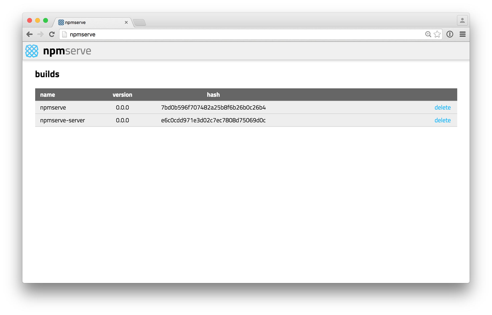

# npmserve-server

This server provides `npm` as a service accessible via http endpoints.
This allows virtual machines and other slow clients to offload the work of building `node_modules` and thus perform significantly faster installs.

## disclaimer

`npmserve` and `npmserve-server` are experimental projects. These tools should not be used for deploying production dependencies. The client/server model does not yet have authentication or authorization in place. This project also does not guarantee the integrity or security of dependencies installed from npm or distributed to clients. Please consider your own requirements and constraints before incorporating `npmserve` into your workflow.

## clients

1. **command-line client**: available at [npmserve](https://github.com/plaid/npmserve).

2. **web interface**: the server provides a web interface to delete and trigger builds:

## implementation

To solve these problems, we provide a server on which clients can execute their
npm installs by uploading a `package.json` file. In response, they receive a
`node_modules.tar.gz` archive containing their install results.

## limitations

1. Presently the server must be run on a machine of the same architecture as the clients. If this is not the case, calls to `/npm/install` may return `node_modules` archives containing extensions compiled for the wrong architecture to the client.

## build semantics

To the extent possible, the `npmserve` server provides operations analogous to
those which a user running `npm` locally might do. Users running locally often
resort to forceful actions such as deleting their entire `node_modules`
directory or clearing their cache. We provide the facility to perform those
actions via the API as well. These are documented below.

## API

`POST /npm/install`
* **behavior**: performs an `npm install` on the server
* **arguments**: `packageJson`: string of `package.json` file contents
* **conent-type**: `application/x-www-form-urlencoded; charset=utf-8`
* **response**: compressed archive `node_modules.tar.gz`, containing `node_modules`

`DELETE /npm/install/:hash`
* **behavior**: deletes the `node_modules` build on the server for the specified build hash
* **arguments**: none
* **response**: void

`POST /npm/cache/clean`
* **behavior**: clears the `.npm` cache on the server
* **arguments**: none
* **response**: void

## environment

This project relies on the following environment variables:

| name | type | default | description |
| ---- | ---- | ------- | ----------- |
| `BUILD_DATA_DIR` | string | `./data` | path to the directory in which to store build data |
| `NPM_CONFIG_REGISTRY` | string | `https://registry.npmjs.org` | the `npm` registry to use for `npm install` |
